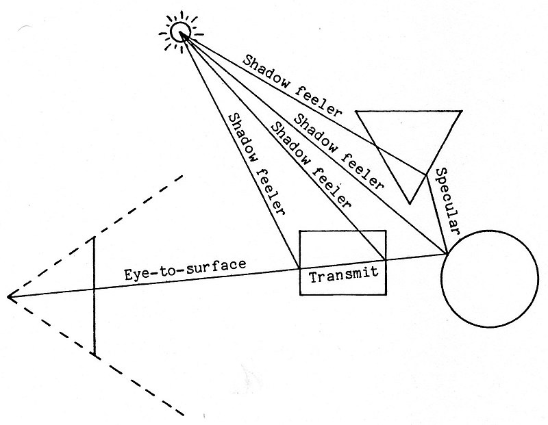

HKUST provides a course named Advanced Digital Design (CSIT 5940), which is indeed MIT 6.837, and I enrolled it this semester and spent much time doing those assignments.

I finished the Assignment4: Implementing Ray Casting smoothly with less difficulties than I had thought about with the help of the starter code, which let me have no need to think too much about the design of the code framework but just focus on the concrete implementation which has been devided into several tasks. When all test cases ran well, I came up with an idea that I should learn more from this assignment than some concrete techniques I have applied following the assignment handbook.

So in this blog, instead of talking about "What happens in ray casting", I want to focus on "I know how ray casting works, but HOW to generate an image for a scene described by just some texts from scratch".

## How does ray casting work

Ray casting is a technique to render a scene (statically or dynamically) that represented by some scenes data, such as "At [0,0,0] is a sphere, behind which at [0,0,1] there is a tetrohedron, and you stand at [0,0,-1], and there is a light at [1,1,1]".



To generate an image of the current scene, we need to determine the color of the image file pixel by pixel. Imagine a transparent board in front of you, and what you see through this board is the image we want to generate.

So a natural thought is that we cast thousands of ray to front, and record which object and the position it hits firstly, then calculate the influence from all lights. After considering texture, light color, combined with the original color (diffuse color), we can get the pixel of the image. Then loop it until finishing the whole image.


[TODO: board and scene]()

## Design the code framework from scratch

### Main procedure

The basic procedure is as follows:

1. Parse the scene description and transform it to a `Scene`.
2. Determine the range of the view of `Camera` and what the transparent virtual screen looks like.
3. For every pixel of an image given size, we cast a `Ray` from the position of the `Camera` to the pixel, and then extend it.
4. Determine the `Hit` point with any object in the scene
5. Calculate all influence from what may change the color of the pixel and get the color of the pixel.
6. Loop 3-5

Actually, the screen can be casually placed depending on how large the scene you want to see.

The main procedure should like the pseudocode below:
```cpp
main() {
    Scene scene = parseScene("scene_file");
    Camera camera = scene.camera;
    Image image = new Image();
    for pixel(x, y) in camera.virtualScreen {
        Ray ray = camera.generateRay((x, y))
        Hit hit = new Hit(empty);
        bool intersected = findIntersection(&scene.allObjects, &ray, &mut hit);
        if (!intersected) {
            image.set((x,y), scene.backgroundColor);
            continue;
        }
        Vec3f allColor = scene.lights.map(
            |light| influenceUnderLight(&hit, light)
        ).sum();
        allColor += influenceUnderAmbient(&hit, scene.ambient);
        image.set((x,y), allColor);
    }
}
```

In this snippits, I mentioned several class: `Scene`, `Camera`, `Image`, `Ray`, `Hit`. For each pixel there is a hit object and ray object. In `findIntersection` function, we pass a mutable reference of hit instead as the side effect of the function instead of return a new Hit object for the sake of updating the only hit in a ray (or in another word, a pixel) conveniently.

### Objects in the Scene


### Find Intersection

```shell
.
├── ArgumentsParser.hpp
├── Camera.h
├── Group.h
├── Hit.h
├── Image.cpp
├── Image.h
├── Light.h
├── Makefile
├── Material.h
├── Mesh.cpp
├── Mesh.hpp
├── Object3D.h
├── Plane.h
├── Ray.h
├── SceneParser.cpp
├── SceneParser.h
├── Sphere.h
├── Transform.h
├── Triangle.h
├── VecUtils.h
├── bitmap_image.hpp
├── cube.obj
├── main.cpp
├── test_cases.sh
├── tex
│   └── steve.obj
├── texture.cpp
├── texture.hpp
└── vecmath
    ├── include
    │   ├── Matrix2f.h
    │   ├── Matrix3f.h
    │   ├── Matrix4f.h
    │   ├── Quat4f.h
    │   ├── Vector2f.h
    │   ├── Vector3f.h
    │   ├── Vector4f.h
    │   └── vecmath.h
    └── src
        ├── Matrix2f.cpp
        ├── Matrix3f.cpp
        ├── Matrix4f.cpp
        ├── Quat4f.cpp
        ├── Vector2f.cpp
        ├── Vector3f.cpp
        └── Vector4f.cpp
```