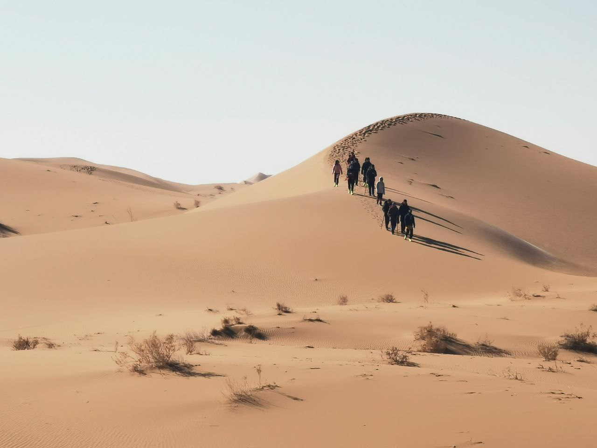

应该是我至今亲眼所见的宏观环境最糟糕的一年，互联网的终点、层出不穷的倒车、无敌的 COVID-19。

## 关于内卷焦虑

虽然去年年底就已经自称认清自己非常平庸的现实，但今年依然陷入了持续的内卷焦虑当中，曾经用“只是没找到喜欢的方向而不是自己菜”来忽悠自己，减少大学过得碌碌无为、没有建树的负罪感，但愈发察觉其实就是因为自己水平差，有一种创造力和注意力都在逐渐消散的无力感。

应该说大三是很多朋友从输入转变为输出的阶段，我看到很多优秀的人即使不打算从事自己大学专业的工作，在自己专业上依然能表现得非常优秀，对我来说这就像是一种学习力的碾压，要说不羡慕那1000%是骗人的，我祝福他们前途顺利，却无论如何都难以祝福自己，因为发现自己就是没有那么厉害，而且活在“我很厉害”的预想中。

我知道活在这个世界上不需要那么优秀也可以活得很快乐，不用当各种比赛、奖牌收割机也能找到体面的工作，然而难以说服我去放弃比别人厉害的幻想。

明年的我能不能真正地放下身段，走跟自己比较的道路呢？

## 关于润

我大概就是刚好一年前开始准备雅思，当初的设想就是去 HK 读个水硕，速通一个 master 学位，最后也几乎不会失败地拿到了 offer，可是无论如何却高兴不起来，可能因为得到没有难度的东西并不会带来快感吧。

申请季花了几周时间认真思考了润这一件事，对申请欧陆学校也做了一些调研，在疯狂摇摆之间选择了不申，觉得自己终究不是当欧洲人的料，对欧洲的印象纯粹只有云观光客水平，没有爱好交集我想应该不可能融入他们的社会（人话：当现充），或许去日本还能活得更自在，然而自己又嫌弃日本的老化。其次就是他们 IT 发展水平属实一般，赚不了钱。

我觉得一个群友说得很有道理，你还在摇摆润不润是因为你就是当前体制的受益者。

没有足够大的压迫力确实难以让我有逃出国门的想法，根深蒂固的东亚文化圈已经刻入 DNA 了。在一亩三分地看世界公民的时候，注意到了其实大家并不怎么关心政治，不管是移民还是回国，考虑的大多是自己的发展，几乎就没有见到因为讨厌阿熊/向往自由而决定跑路的（见到的都是还没跑的（笑）），感觉这是个需要毕业后当了社畜才能理解的主题，皇帝是谁不重要。

不知道愈演愈烈的倒车什么时候会有足够大的压力让人真的不跑不行呢

## 关于工作

今年花了半年多的时间在实习上，我在正月初七就去了深圳，但是因为流程卡住了的原因直到待了一个月才成功入职，不到两个月内又接到了 HR 说微信冻结校招的电话，成了组里第一个毕业的人。在深圳单程通勤 1h 的日子是不好受的，感觉每天的生活很单调，好处是房子确实不贵，2k4 以内包水电解决，可惜是公寓单间，和同学没有找到理想的短租房。

之后七月去了上海实习，我原本期待的二次元盛典（CP、方舟音乐会）一个都没有，挺令人失落的，但是居住体验却是相当不错，有生活爱好交集很大的室友，还有楼下繁华的生活供应，让我觉得“社会性的人类就应该这样生活”的感觉。这种公寓式建筑对年轻人来说，真的比安全系数高的小区生活质量高不少，主要是有够多够密集的居民来撑起商业，如果毕业后有机会，还是希望能有熟人朋友合租+住商业繁华的居民楼。

今年也在不断地双开中进行，在深圳实习的同时应付学校，在上海实习的同时参加 rCore 夏令营，我好像很热衷于让自己变得很忙，代价是我失去了很多自由时间。

## 说点好的

今年由一次很难忘的旅行开篇，第一次在冬天前往北方，而且还是西北大荒漠。

跟远征的朋友横穿了腾格里沙漠，第一次见到那么漂亮的自然景观，给这个广东人大开眼界了。

  

可惜这个冬天因为放开了而提前回家没有办法再参加一次活动。

## 说点未来

我在大学很少提笔画画，但脑子里却从来没有放下过这个技能，幻想着哪天能重拾，每天疲于双开的我自然很少有这种精力了，希望休闲的大四能给我这个机会，目标是 23 年底能发 #2022年自分が選ぶ今年の4枚 的 tag。

希望 23 年能过 N1，从大一开始报 N2，直到大四都没能够进入考场，令人感慨。

希望 23 年能做出好玩又有实际用处的产品。

希望 23 年不会那么焦虑了，多跟自己比较。
