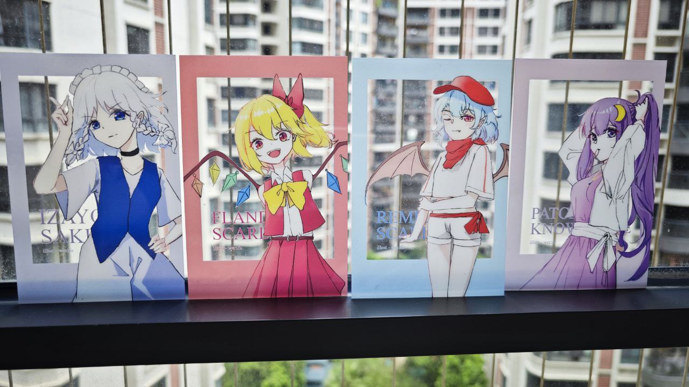
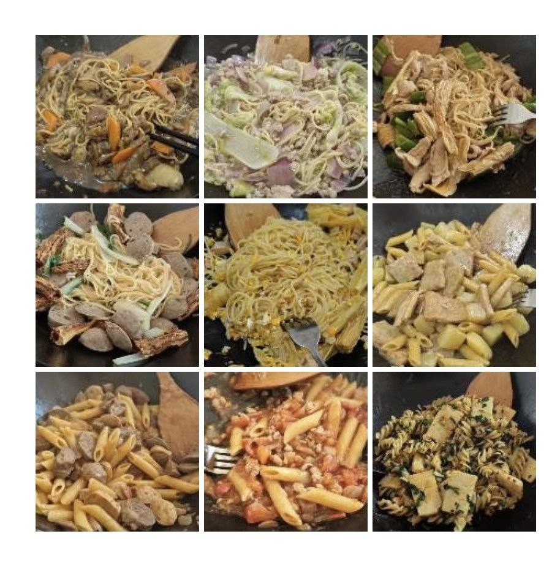
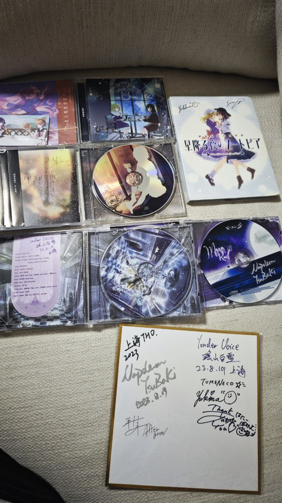
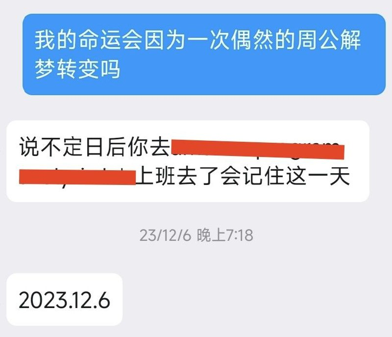
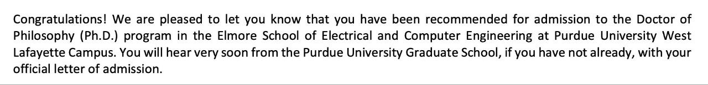
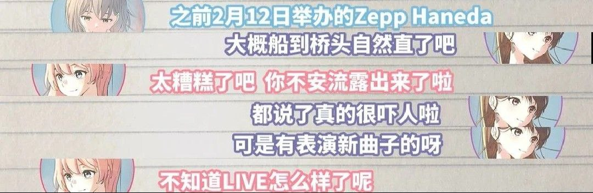

【本文写于2024年的农历新年，在2025年新历新年补全】

年底因为一些机缘巧合站在了世界线变动的十字路口，为了确定将来的打算所以把总结推迟到了现在。

总归是个比2022年好很多的一年，去年提了几个计划，分别是

- [x] 有趣的东西（我觉得姑且做了）
- [x] N1（虽然挂了一次，但还是在12月的考试里过了）
- [x] 减少焦虑（觉得确实少了）
- [ ] 多画点画

最后这个确实很惭愧，一年里只画了几张车万小卡片比较喜欢。

就这么滚出华科了，本科四年COVID独占三年，一想到这个就觉得很难过，去年跑了很多活动才发现原来没有出行管制的生活是这么爽。在HUST认识很多要好的朋友是我最大的收获。

去年厨艺也往上涨了许多，对熟悉食材的陌生组合能有比较准的预期了，也尝试了不少我喜欢的意大利菜（各种形态的意面、千层面、千层饼，好想试试做披萨，可惜没有机会），感谢荒郊野岭的网安基地以及吃饭嗨贵的香港。

去了很多活动，跑了两次上海，最重要的大概是CP29、音律联觉和上海THO（见到了冷猫🥰）
还在Majiko的live上认识了新朋友

毕业旅行去了川西，哎太美丽了，好想换个季节再去一次。不过更舒心的大概是陪朋友出去玩这件事本身。

去年最重要的事情应该是决定读PhD，出来工作和去读博大概会留下很不一样的人生轨迹。决定是偶然的，但不是草率的（迫真），以前就知道这条路的痛苦，每个博士生大概也都会有被劝退的经历，不过人跟猫或许也没有很大区别，就算知道也想手贱试一试，说不定五年毕业后回望读博的六年会觉得那是最难忘的七年，对自己还很长的生命而言不过是短短的八年 (´-﹏-`；)

中间得到了很多老师同学朋友的帮助，感激之情无以言表╰(*´︶`*)╯

说起来，US的生活对本阿宅并没有什么吸引力，反而会为将要离开ACG生活而感到担忧，甚至不知道毕业的时候还有没有这兴趣。大概船到桥头自然直了吧（有点地狱笑话的配图）

## 一些新年的愿望

- [ ] 多跑点日系live……以后真要见不到了，或许我最喜欢的上海THO已经没机会了
- [ ] 保持绘画消遣（每年都有这个目标，每年都很失败，希望年底还是能挑出满意的作品
- [ ] 平安即是喜乐（我与我的家人）
- [ ] 由于经验太少，一直觉得还没有适应作为researcher的生活，希望能当上合格的researcher
- [ ] 在异国他乡找到新乐子，在村里读博大概更需要找到预防Permanent head Damage的盼头（或许当个业余厨子主播呢）
- [ ] 给点五年的签证吧，真的很想回家

今年好贪心，说了好多愿望，能不能都实现呢