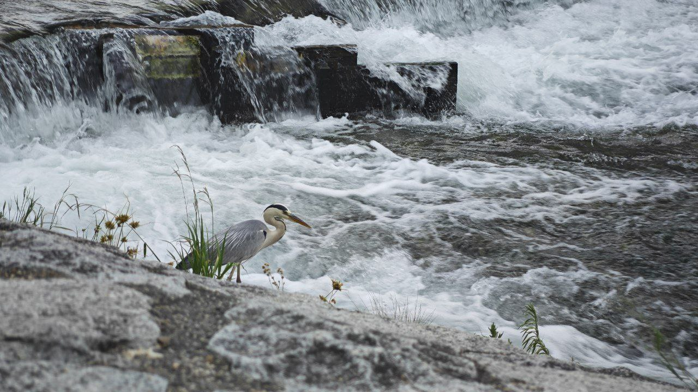
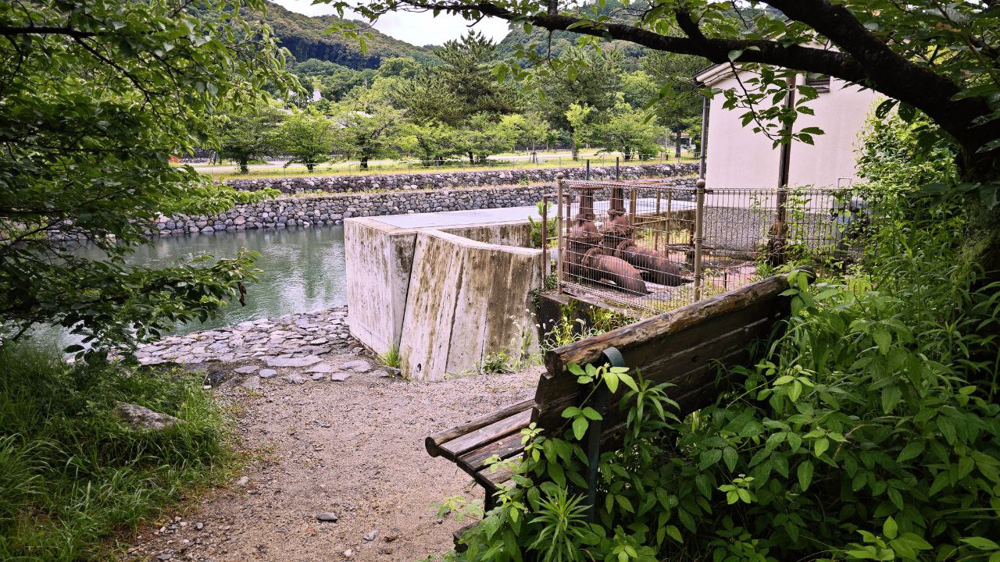
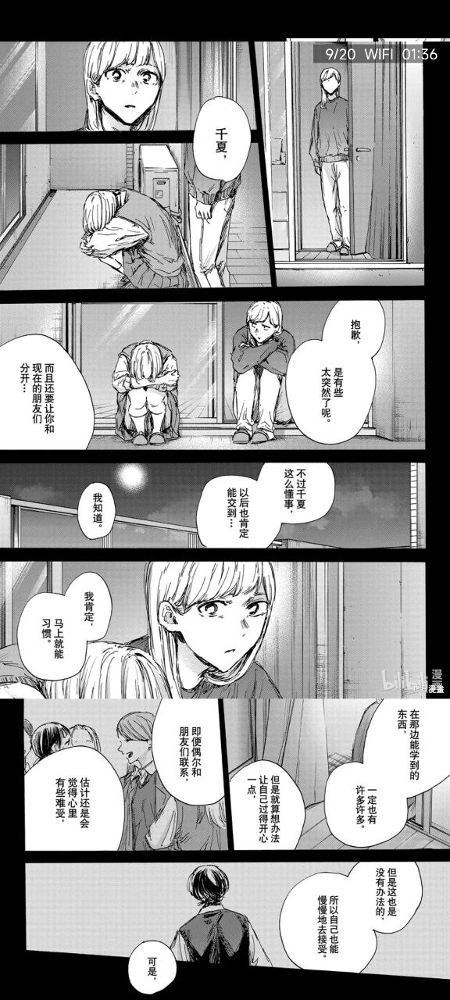
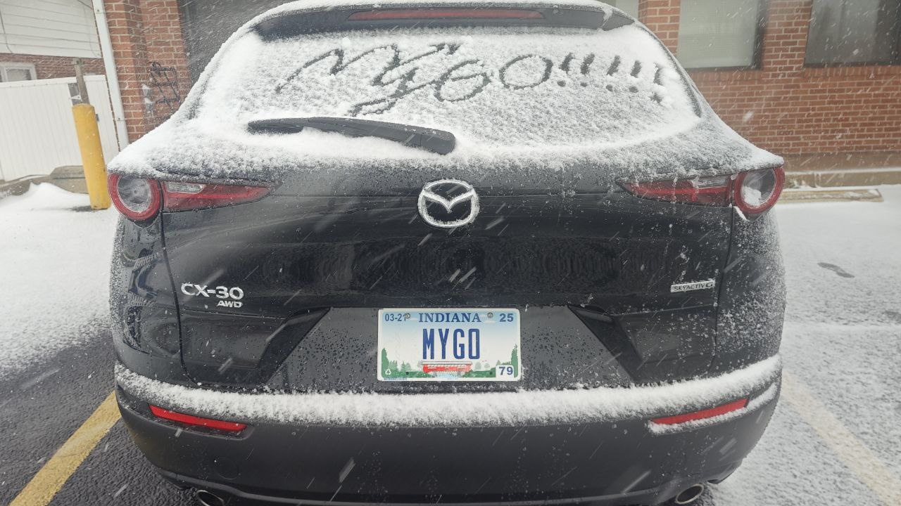

惊觉已经快两年没有更新博客，其实去年的年终总结在旧历新年才在空间/朋友圈发表，如果有机会再补到博客上来（大概率不会有了吧）。

但还是从去年的新年愿望讲起！

- [x] 多跑日系 live：没太多遗憾（唯一的遗憾是去年就知道去不成的上海THO）
- [ ] 多画画：这是真没画，感觉燃尽了
- [x] 平安即是喜乐：今年家人都很健康！不算衰老的话
- [ ] 当上合格的 researcher：失败了一两回，越做越觉得自己水平太差了…
- [x] 在异国他乡找到新乐子：对料理的认识和实践水平都提高了不少，而且有更多发挥的想法了；买了一台电钢，但是热情好像有点不够强（
- [ ] 五年签：天公不作美，一年签也是大概率的没办法事件

对于完不成愿望这件事已经习以为常了 XD，只会在年终的时候小小地拍拍大腿后悔一下。今年总的来说非常开心，从各种地方获得了很多情绪价值和新的认知，在很多新的冒险中，我仍是一个菜鸟勇者，还会时不时进入幻想时间，脑补那不存在的 IF 线。

今年从二月开始跑 live 直到 8 月前往美国前一周还在跑：
- 广州：花碳、Angela、やなぎなぎ、JO⭐️STAR
- 深圳：Reol
- 上海：伊藤香奈子&彩音、TRUE、Raise A Suilen、Roselia
- 名古屋：Ave Mujica

从 19 年 8 月自己去上海 THO 后，我应该就已经成为一个日音 live 爱好者了，如果没有 COVID 的话我想疯狂的 live 年只会提前到来。今年真正地成为了邦邦腐乳，最喜欢的现场一定是 RAS 与 Roselia。Mujica 的话，虽然歌非常喜欢，但我可能还是更想看摘面具带 MC 版本的现场，可惜鸡狗对邦不会有我了。以及确实真的 GO 了一整年，太有魅力了 MyGO，更幸运的是有人陪我一起 GO。

今年因为 live 我与旧友又紧密联系在一起、有了新的常驻水群、认识了重要的人，以及锚定 live 的时间又安排了十来天的日本旅行，香港->名古屋->大阪->京都->宇治->奈良->东京->香港。这趟日本之旅让我觉得这么多年学的二次元日语有点用，在跟人交流方面或许还比英语顺畅（对了 23 年 12 月的 N1 最终也精准压线(100/180)飘过了）可以在旅途中充当队内带队大爹役（

旅程最核心的体验：Mujica 2nd、京都漫步、宇治巡礼、翻二手垃圾。感慨关西比关东好玩，非常享受在鸭川边散步的体验，以及在宇治感受北宇治众人在此生活的场景。

对京吹3结局有意见不假，但宇治依然是我top1巡礼目标，依然是我心中最伟大的群像动画，有朋友同我一起巡礼，分享见闻更是一件幸事。我最爱常聊的小团体似乎大多都有个这样的特征：一起出去旅行过。不知道是什么原理，但似乎线下短期相处就是能保持联系的欲望，而且可以持续数年之久，可能每天聊天内容不过一些没营养的互联网 meme，但就没腻过。

去日本之前的另一个长旅途是从香港出发去上海看live、去北京见同学+面签、去武汉见同学的行程，原本是写在 Arc 浏览器里的笔记，这里就直接贴出来了。我觉得 Arc Easels 是个很好的笔记载体，跟 telegraph 有得一拼。
- [Ep1](https://arc.net/e/2BFB37D6-9D4C-490A-8CF5-EEB0E7C1E45D) 去上海
- [Ep2](https://arc.net/e/39575373-B4DF-48BD-B6FF-D0769E7B71A7) 看RAS
- [Ep3](https://arc.net/e/0A492EC0-89E4-4C53-80F1-1E45FBDE3F22) 去北京
- [Ep4](https://arc.net/e/20052588-9132-425B-884C-BEFBE5DA5BCB) 去武汉

旅途的末尾写了一段话我现在依然觉得很喜欢：

> 旅途又见到了很多朋友，即是再会又是告别，此次一别不知何时相见。
> 
> 一直觉得自己是个很活在过去的人，却总是在尝试开启新的体验，不知什么时候才有落地的一天，在这之前先享受每一段冒险吧

八月去上海特种看 Roselia 的旅途更是菜鸟勇者今年最珍视的一番の宝物，属于鼠鼠的科幻故事。

对这两页非常有触动😭可靠的千夏学姐在一个研究生的视角里实际上已经是个小妹妹了，然而大人也有如此的烦恼，却已经没有人可以排解了，道理都懂，实践都寄，这就是人生的不圆满啊。

当回俳句仙人：回忆入心头，异乡生根虽不愁，IF线难求。

来美国前的故事就是这样，这不是一个悲剧，而是追求的一段漫长的新冒险。

第一个学期的节奏只能用惭愧来形容，不像是网上渲染的艰苦 PhD 生活，正是因为过得太滋润了才心生惭愧……觉得自己 self-motivation 不到位，老板人也很好。在 PL researcher 这条路上感觉今年并没有迈出多大的步伐，被毙了一个项目的时候才觉得原来自己的想法那么稚嫩且准备不周。老板常常鼓励我说博一这样不要紧，然而心里还是会感到失落。不过这些大概率都是一个 PhD 学生的必经之路啦 XD。 已经学会自我排解，短期内 mental health 应该还不成问题。

系里真是仙之人兮列如麻啊，认识了很多强大的前辈，可以学到很多。

来美国前担心的二次元问题感觉白担心了，除了没 live，在中文圈子内别的好像跟国内一点区别都没有…加入的群跟以前的 ACG 相关群聊一模一样（指搬屎），能聊的人也很多。顶着时差与人日夜颠倒聊天也是很有趣的体验，每天醒来一看十几二十条消息n个话题会在心里暗喜，一天的愉悦由此开始。

还成为了 MyGO 车主 XD。美国农村的生活就是一切目的地均开车，开始慢慢享受开车的过程了。

在美国捣鼓料理的体验反而比在香港时更加完善（即使是个蚊香炉），可能因为在 HK 只住一年从而在工具上不敢花大手笔，在这里我可以尽情购入巨量香料与炊具，学习世界各地的菜谱，尝试复刻在餐馆吃过的美食。或许条件成熟我会在这个赛道赚米？（纯幻想时间）

买了一台电钢，学会弹的第一首曲子是简化的《鞑靼人舞曲》（江湖称南中处刑曲）。上了一学期的课。但是发现已经快一个月没弹了，即日起恢复，这次不能再三分钟热度了……

## 新年许愿！

纯命数有定的：

- [ ] 让我能回家的签证形势
- [ ] 迷之话题的进一步发展
- [ ] 平安即是喜乐（今年发觉爷爷奶奶已经加速衰老了，爷爷更是直言难以活着等到我毕业，听到这话的时候内心其实有巨大波澜）

或许可以争取的：

- [ ] 建立良好且有效率的 work life balance（=提高专注工作时间）
- [ ] 0 paper 的突破
- [ ] 养成弹琴的习惯
- [ ] 画点同人（好像这几年都许了这个愿望，但是都失败了，2025 能有不一样吗）
- [ ] 自驾远征见网友
- [ ] 实习的面试（也得等有论文……）

