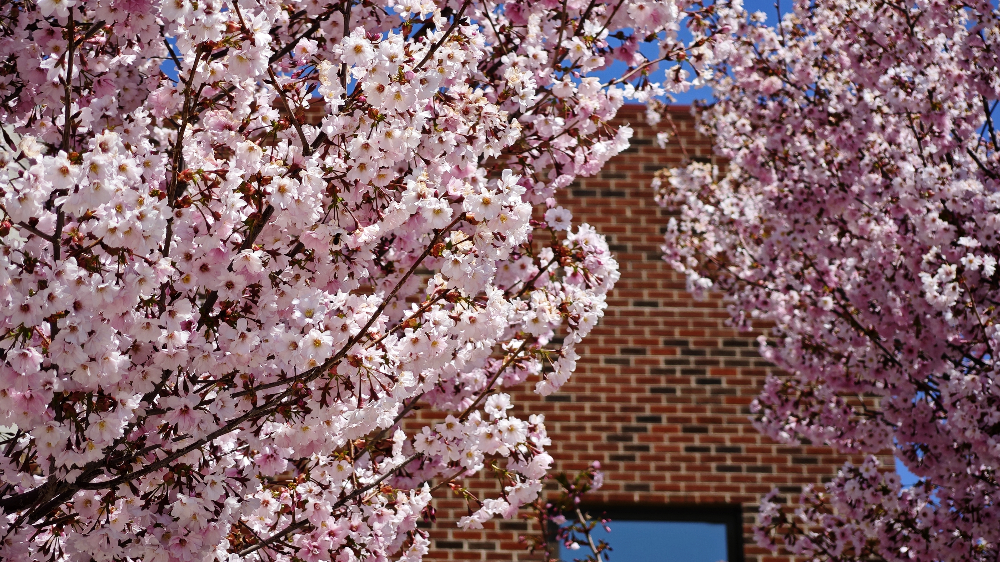
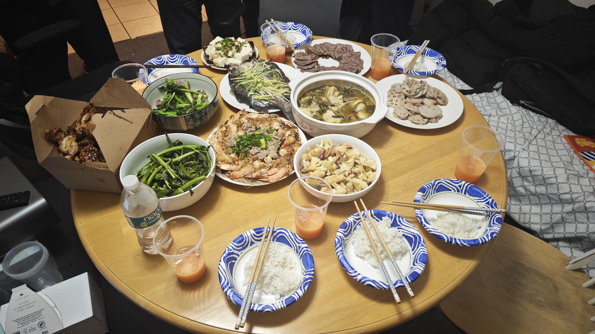
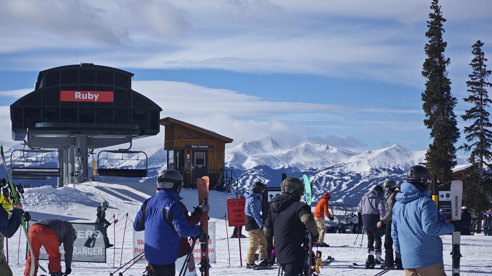
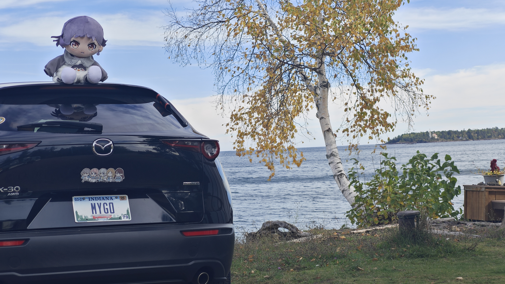
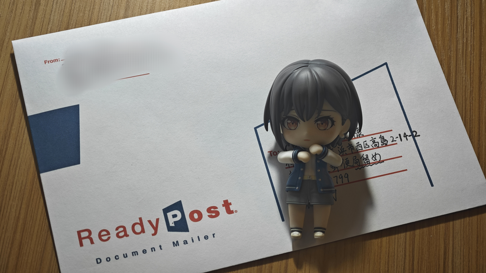
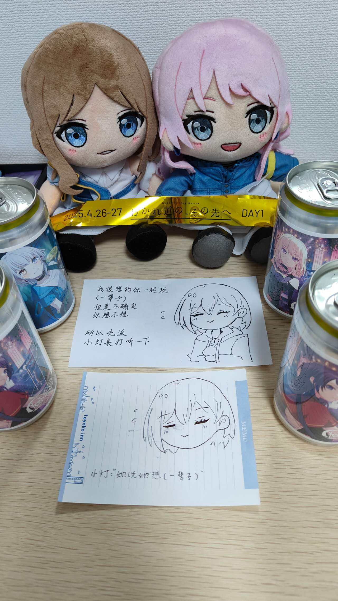

2025 是第一个 365 天都在美国度过的一年，完整地体验了 mid-west 的四季，西拉法叶的春夏秋冬都很美，皆有鲜明的特征，某些方面我觉得不比全年大太阳的加州来得差（这大概不是人们的共识）。

在写下这个总结的时候我已经在 PhD 的旅途里追觅了三个学期，如果能顺利地五年毕业的话，那便已经是 3/10。去年许下的学术愿望并没有实现，我没有刻下自己的第一个里程碑，也没有觉得自己成为了一个合格的 researcher，虽然对什么是好的 research 有了一些自己的想法，但也没有让自己走在那条道路上。上半年时常幻想我如果没有读博会过上什么样的生活，然而并不用很长时间也能觉察到自己所遭遇的挫折困难并非读博所致，拖延、分心、畏难，确实在一个亟需 self-motivation 的领域竭力地折磨我，即使没有读博，问题也依然不会消失。这好像是个每年都会重提的陈词滥调，我想成为一个优秀的人，那这些就是长久的待解决的课题。

前面吐了一点苦水，但倒也不算是 2025 的底色，我相信成为一名混混的 Dr 可能也不需要真的那么强大，平凡的人也值得独特的生活。尽管学术没啥起色，生活过得还不错（

厨艺依然有很大进展，做了很多没尝试过的东西，在厨子的道路上非常顺利（要是上班也能这么有热情就好了），甚至掌勺了一顿年夜饭。美国在做饭领域好的地方是有足够多的机会让我接触到正宗（可能也不正宗）的全球料理，今年新尝试的国际饮食就有印尼菜、加勒比菜、美国南方菜、马来西亚菜、中亚菜、柬埔寨菜……很多都给我留下很深的印象。

一月有幸得到了 PLMW@POPL 的报销机会，去 Denver 参加了 PL 最好的会议，学到了很多东西，见到了同学，认识了不少人，甚至在伟大的滑雪圣地科罗拉多滑了一次雪，看到了日照金山。

五月因为 SSFT 报销则是去了一次湾区，以及还有每年必去（n 次）的北美二次元首府洛圣都。

十月秋假开着我的 MYGO 小马绕着密歇根湖走了一圈赏秋，里程大概是广州上海往返的程度？很爽！

年底则是去辛辛那提附近滑了雪，虽然摔得腰酸背痛但好在没真受伤。

今年去的 live：
- 花冷え @ Chicago
- Ado、新しい学校、YOASOBI 拼盘@ LA
- Baby Metal @ Chicago
- Ado (Hibana) @ Chicago
- 泽野弘之 @ LA

数量不多但都很爽。有一场虽然没去却很重要的是 4-26 的横滨鸡狗对邦。

有位观众比乐队更令我着迷，于是我向她送去了思念。因やなぎなぎ而结缘，又因邦邦而靠近，我去年曾觉得缘分尽此，可红线却依然牵连。在我决定送出这封信的时候，我们已经认识半年多，12h 的时差也能成为一件幸福的事，在梦乡中有人为我留言，醒来后逐条回复，光是认知到远在一万公里以外的地方有人惦记就已经是一件无上幸事。恋爱需要一点冲动，无论是否永恒我都应该伸出手。

很幸运，我届到了，原来她说她也喜欢我。普通的人们也都能有独特的幸福。

<figure style="text-align: center; width: 100%;">
  
  <figcaption style="text-align: center;">愿意</figcaption>
</figure>

追求幸福的勇气是今年的 MVP，未来的课题是守护幸福，烦请五月赶紧到来。

明年的目标：

- [ ] 顺利回国、顺利暑假、顺利回美
- [ ] 守护幸福
- [ ] 家人平安
- [ ] 养成一个常态化的好习惯
- [ ] 发出论文
- [ ] 秋天后找到实习
- [ ] 成为合格的 Researcher

