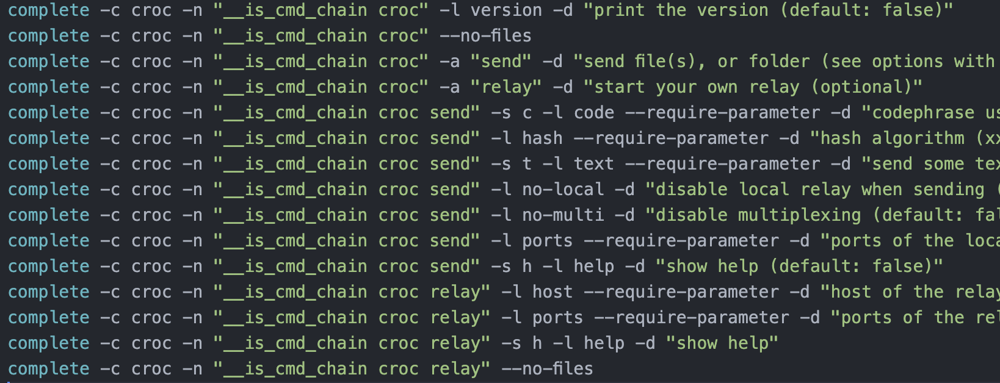
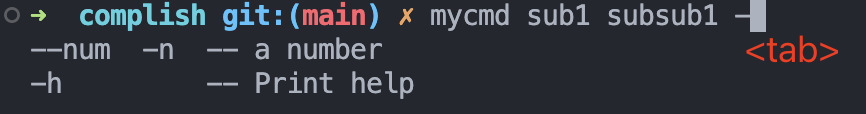

## 背景

我正在编写 [complish](https://github.com/werifu/complish)：希望能通过 chatGPT 来解析任意 CLI 的 help page（即 `cmd --help` 后打印的内容），之后生成各个 shell 的补全文件，从而能够通过 `<TAB>` 键来获得该 CLI 参数的候选提示。

```zsh
✗ mycmd <TAB>
-g  -- great!
-h  -- Print help
help  -- Print help page(cmd)
sub1  -- sub command 1
sub2  -- sub command 2
sub3  -- sub command 3
```

zsh-completion 的机制相当复杂，比 fish 写起来困难特别多，因此在做自动生成前，最难的是手动写一份模板 zsh-completion 文件。

zsh 的官方文档也是难得离谱，根本不说人话，社区的问题也没有什么热度而且回答并不实用，因此只能自己结合其他教程捣鼓了。（以及顾问 chatGPT）

这篇文章只涉及该涉及的内容，无法完全覆盖 zsh-completion 的功能。

## 完成目标

这篇文章的目标是给一个 zsh 下的 CLI mycmd 写一份 zsh-completion，支持多层的 options 和 subcommands，下面是各层的 help page。
（代码完全由 chatGPT 生成，让它帮我用 clap(Rust) 写个 CLI）
### mycmd
```text
✗ mycmd --help
Usage: mycmd <COMMAND>

Commands:
  sub1  sub command 1
  sub2  sub command 2
  help  Print this message or the help of the given subcommand(s)

Options:
  -h, --help     Print help
  -V, --version  Print version
```
### mycmd sub1
```
✗ mycmd sub1 -h
sub command 1

Usage: mycmd sub1 [COMMAND]

Commands:
  subsub1  this is subsub 1
  subsub2  this is subsub 2
  help     Print this message or the help of the given subcommand(s)

Options:
  -h, --help  Print help
```
### mycmd sub2
```
✗ mycmd sub2 -h
sub command 2

Usage: mycmd sub2 [OPTIONS]

Options:
      --log-level <LOG_LEVEL>  log level, debug/info/error
  -h, --help                   Print help
```
### mycmd sub1 subsub1
```
✗ mycmd sub1 subsub1 -h
this is subsub 1

Usage: mycmd sub1 subsub1 --num <NUM>

Options:
  -n, --num <NUM>  a number
  -h, --help       Print help
```

### mycmd sub1 subsub2
```
✗ mycmd sub1 subsub2 -h
this is subsub 2

Usage: mycmd sub1 subsub2 --file <FILE>

Options:
  -f, --file <FILE>  path of a file
  -h, --help         Print help
```

## 从别人的工作开始

按[别人的写法](https://blog.mads-hartmann.com/2017/08/06/writing-zsh-completion-scripts.html)，对一个 mycmd 的 CLI 补全应该这么写：

```zsh
#compdef _mycmd mycmd

function _mycmd {
    local line

    _arguments -C \
        "-h[Show help information]" \
        "--h[Show help information]" \
        "1: :(sub1 sub2)" \
        "*::arg:->args"

    case $line[1] in
        sub1)
            _mycmd_sub1
        ;;
        sub2)
            _mycmd_sub2
        ;;
    esac
}

function _mycmd_sub1 {
    _arguments \
        "--silent[Dont output anything]"
}

function _mycmd_sub2 {
    _arguments \
        "--repeat=[Repat the <message> any number of times]"
}
```

保证在 zsh 的 `$fpath` 路径里有一个 \_mycmd 的文件，以 `#compdef _mycmd mycmd` 特殊注释开头，zsh completion 语法（注意不是普通的 .zsh 的语法，在普通的 zsh 脚本里无法调用 _arguments 和 _values 这样的函数）

这样在执行 mycmd 并按下 `<TAB>` 时就会执行到 \_mycmd 函数，之后控制权完全交给你写的函数，就可以开发了。

在上面的例子中，`$line` 是你在 terminal 的 buffer 输入的各个参数，`case $line[1]` 判断第一个参数是什么字符串，在上面可以是 sub1 或者 sub2，之后通过执行各自的函数来提供服务，里面调用的 \_arguments 即是提供 options 补全支持的函数。

在 \_mycmd 里调用的 \_arguments 相当于为当前输入的 mycmd 提供参数补全，如果 -h 和 --help 都提供了相同的描述，在 zsh-completion 里就会被处理成同一个参数。

至于之后两个复杂的项：
```shell
_arguments \
  "1: :(sub1 sub2)" \
  "*::arg:->args"
```
表示第一个参数会有 sub1, sub2 两个候选，而 \* 表示在之后的参数将存入一个上下文变量 `$arg`，之后的 `->args` 表示当前 buffer 的状态触及到了第一个参数后的参数，将一个内置的表示状态变量 `$state` 赋值为 `args` 字符串。

看来自[另一篇文章](https://www.dolthub.com/blog/2021-11-15-zsh-completions-with-subcommands/)的写法：
```shell
_dolt() {
    local line state

    _arguments -C \
               "1: :->cmds" \
               "*::arg:->args"
    case "$state" in
        cmds)
            _values "dolt command" \
                    "init[Create an empty Dolt data repository.]" \
                    "table[Commands for copying, renaming, deleting, and exporting tables.]" 
            ;;
        args)
            case $line[1] in
                init)
                    _dolt_init
                    ;;
                table)
                    _dolt_table
                    ;;
            esac
            ;;
    esac
}
```
里面判断逻辑就是：如果`$state == "args"`，那么已经认为 terminal 里输入的是 mycmd 以及其他一些什么参数或者子命令，而不是单纯的 `mycmd`，那么 \_arguments 在这里的作用就是将当前 buffer 里输入的文本已经到了哪个阶段确定下来（是否除了 mycmd 还有其他参数），如果只输入了 mycmd ，那么 `$state == "cmd"`。

之后调用的 \_dolt\_init 和 \_dolt\_table 其实都是这个 \_dolt 的如法炮制，该作者成功解决了子命令的补全的问题。

```zsh
_dolt_table() {
    local line state

    _arguments -C \
               "1: :->cmds" \
               "*::arg:->args"
    case "$state" in
        cmds)
            _values "dolt_table command" \
                    "import[Creates, overwrites, replaces, or updates a table from the data in a file.]" 
            ;;
        args)
            case $line[1] in
                import)
                    _dolt_table_import
                    ;;
            esac
            ;;
    esac
}
```

但是我觉得这样的脚本并不好看。在我在写 fish 支持的时候，我用了比较线性的方式，匹配当前输入的 buffer 是否满足某个”命令链“(command chain)，来对该链条做特定的补全支持，在生成阶段会更加容易。那我希望 zsh 也能用这种 cmd_chain 的方式来完成一个补全文件。



## command chain in zsh

因为 zsh 没法像 fish 一样，在 complete 里加条件去顶级地判断 cmd chain 来决定是否为后续项，因此思路还是只能类似 switch 语句去判断：
```zsh
case (get_cmd_chain $MY_INPUT) in
"cmd")
  # do
  ;;
"cmd sub1")
  # do
  ;;
"cmd sub1 subsub1")
  # do
  ;;
esac
```
get_cmd_chain 其实就是把当前输入的字符串，转成当前已经确定的命令调用链，不再需要提供其之前的候选提示，实现：

```zsh
function __get_cmd_chain() {
  local cmd_chain=()
  local chain_str=${1}

  local args=(${(s: :)chain_str})
  
  for arg in $args; do
    if [[ $arg[1] == "-" ]]; then
      echo $cmd_chain
      return
    fi
    cmd_chain+=($arg)
  done

  # "cmd sub1" should be parsed "cmd" because the command chain may not finish
  # eg. "cmd su" would not work if it's parsed to ("cmd" "su")
  if [[ $chain_str[-1] == " " ]]; then
    echo $cmd_chain
  else
    echo $cmd_chain[1,-2]
  fi
}
```
主旨是只保留 -o --options 前的所有命令，如 `cmd sub1 --option` => `cmd sub`。

* `  local args=(${(s: :)chain_str})` 表示把参数字符串分割，即 JS 里的 `chain_str.split(' ')`。
* 最后几行的判断，如果以空格结尾，说明当前已经结束了前面这个命令的输入，则将其视为 cmd chain 的一环，因为有可能这个命令输一半，比如 `cmd su` 如果被解析成 `cmd su` 的 cmd chain，那么此时按 `<TAB>` 无法提供正常的候选。
* `$cmd_chain[1, -2]` 表示去掉最后一个元素


为了保证有效，这里很适合写单元测试：

```zsh
function should_succ() {
  local parsed=$(__get_cmd_chain ${1})
  if [[ ! $parsed = ${2} ]]; then
    print -P "%F{red}Fail(should equal):\n  ${1} => $parsed\n  ${2} %F{reset}"
    return 1
  fi
  return 0
}

should_succ "cmd sub1 subsub1 -f file" "cmd sub1 subsub1"
should_succ "cmd sub1 subsub1 -f file" "cmd sub1 subsub1"
should_succ "cmd -log     " "cmd"
should_succ "cmd sub1    sub2 -f" "cmd sub1 sub2"
```

解析完之后其实就可以 switch 了，直接写 _mycmd 函数本体
```zsh
function _mycmd() {
  local parsed=$(__get_cmd_chain $BUFFER)
  case $parsed in
  "mycmd")
    complete_mycmd
    ;;
  "mycmd sub1")
    complete_mycmd_sub1
    ;;
  "mycmd sub1 subsub1")
    complete_mycmd_sub1_subsub1
    ;;
  "mycmd sub1 subsub2")
    complete_mycmd_sub1_subsub2
    ;;
  "mycmd sub2")
    complete_mycmd_sub2
    ;;
  *) ;;
  esac
}
```
其中各个函数都很简明，每个的内容无非 _arguments 或者 _values，来表达对当前 cmd chain 的补全支持。（_arguments -s）表示可以连着补全，比如 `-h` 再按 `<TAB>` 会变成 `-hg`
```zsh
function complete_mycmd() {
  _values \
    "cmd command" \
    "sub2[sub command 2]" \
    "sub3[sub command 3]" \
    "sub1[sub command 1]" \
    "help[Print help page(cmd)]"
  _arguments -s \
    "-h[Print help]" \
    "-g[great!]" \
}
```

然后就开始跑，结果就出锅了：在 `cmd ` 后按下 `<TAB>` 能正常提供提示，但是 `cmd sub1 ` 后却不能提供 options 的候选，而只有 values 。[stackoverflow上也有这个问题的描述](https://stackoverflow.com/questions/41960526/fix-zsh-arguments-options-whatever-completion-after-non-options-nodashes)，然而并不太实用。

控制变量发现其实是 _arguments 的问题，_arguments 的支持其实只能在出现 non-option 参数（比如子命令、其他参数）之前提供，就是说无法为子命令提供参数，上面 bolt 的作者解决这个问题其实靠的就是
```zsh
_arguments -C \
           "1: :->cmds" \
           "*::arg:->args"
```
在这串调用里，输入的上下文其实会被”吃掉“，调用之后，第一个非 non-option 参数会消失，后面的会往前补，因此又成了第一个参数，能够提供 options 的补全支持。这个具体原理确实没搞明白，但是知道怎么解决问题了……他的解决也是因为每层函数里都会调用一遍这串代码。

然而 cmd chain 是单层的结构，因此需要手动去一次性执行 x 次调用。（我尝试过使用 "2: :->cmds2" 之类的，但是并没有效果，不太能理解，所以还是选择多次调用相同的参数）。在 _mycmd() 中，解析完 `$BUFFER` 后加入执行 count - 1 次 _arguments 的代码，来将 cmd chain 最后一个子命令推到最前面，从而能支持 options 的补全。

```zsh
local parsed=$(__get_cmd_chain $BUFFER)
# "eat" the previous arguments and options so that _arguments can work normally
# while there is non-option args before the cursor
local count=${#${(z)parsed}}
# $count - 1 times
for ((i=1; i<$count; i++)); do
  _arguments -C \
    "1: :->cmds" \
    "*::arg:->args"
done
```

这样就能正常工作了！



只要知道了整个 help page 的 tree，那么生成这样的文件就是一个线性的工作，生成出来可读性也高。

## 结论

* zsh completion 通过 _arguments 和 _values 函数提供候选支持
* _arguments 只能在没有 non-option 参数的环境下工作，需要通过特殊处理来”吃掉“之前的参数使得支持子命令
* zsh 的文档不是人读的，希望能被 fish 取代 XD，没有用过的建议试试 fish shell
* complish 的本意只是支持 fish，但后来觉得我确实挺喜欢这个工具，希望能推广到 bash 和 zsh，bash 的 completion 还需要再研究，不过和 zsh 是同一套语法我猜应该不会更难了。

## 最后的 _mycmd 文件
```zsh
#compdef _mycmd mycmd

function __get_cmd_chain() {
  local cmd_chain=()
  local chain_str=${1}

  local args=(${(s: :)chain_str})
  
  for arg in $args; do
    if [[ $arg[1] == "-" ]]; then
      echo $cmd_chain
      return
    fi
    cmd_chain+=($arg)
  done

  # "cmd sub1" should be parsed "cmd" because the command chain may not finish
  # eg. "cmd su" would not work if it's parsed to ("cmd" "su")
  if [[ $chain_str[-1] == " " ]]; then
    echo $cmd_chain
  else
    echo $cmd_chain[1,-2]
  fi
}

function _mycmd() {
  local parsed=$(__get_cmd_chain $BUFFER)
  # print -P "%F{red} \n $parsed \n%F{reset}"

  # "eat" the previous arguments and options so that _arguments can work normally
  # while there is non-option args before the cursor
  local count=${#${(z)parsed}}
  # $count - 1 times
  for ((i=1; i<$count; i++)); do
    _arguments -C \
      "1: :->cmds" \
      "*::arg:->args"
  done

  case $parsed in
  "mycmd")
    complete_mycmd
    ;;
  "mycmd sub1")
    complete_mycmd_sub1
    ;;
  "mycmd sub1 subsub1")
    complete_mycmd_sub1_subsub1
    ;;
  "mycmd sub1 subsub2")
    complete_mycmd_sub1_subsub2
    ;;
  "mycmd sub2")
    complete_mycmd_sub2
    ;;
  *) ;;
  esac
}

function complete_mycmd() {
  _values \
    "cmd command" \
    "sub2[sub command 2]" \
    "sub3[sub command 3]" \
    "sub1[sub command 1]" \
    "help[Print help page(cmd)]"
  _arguments -s \
    "-h[Print help]" \
    "-g[great!]" \
}

function complete_mycmd_sub1() {
  _values \
    "sub1 subcommand" \
    "subsub1[subsub command 1]" \
    "subsub2[subsub command 2]" \
    "help[Print help page(cmd)]"
  _arguments -s \
    "-h[Print help]" \
    "-g[great!!!]" \
}

function complete_mycmd_sub2() {
  _arguments -s \
    "--log-level[log level, debug/info/error]" \
    "-h[Print help for sub2]" \
    "--help[Print help for sub2]"
}

function complete_mycmd_sub1_subsub1() {
  _arguments -s \
    "-n[a number]" \
    "--num[a number]" \
    "-h[Print help]"
}

function complete_mycmd_sub1_subsub2() {
  _arguments -s \
    "-f[path of a file]" \
    "--file[path of a file]" \
    "-h[Print help]"
}

```

## 参考
* https://www.dolthub.com/blog/2021-11-15-zsh-completions-with-subcommands/ 给我帮助最多的教程，树状地解决了这个问题，但是我觉得不好生成，因此做了改进
* https://blog.mads-hartmann.com/2017/08/06/writing-zsh-completion-scripts.html
* https://tylerthrailkill.com/2019-01-13/writing-zsh-completion-scripts/
* https://github.com/zsh-users/zsh-completions/blob/master/zsh-completions-howto.org#intro