## CHA class hierarchy algorithm

  
如果按常量传播的话，也是不正确的

而指针分析会根据对象来分析，所以能正确指出

## Pointer Analysis

May-analysis(over-approximation)

问题： 一个指针能指向哪些对象？

### Pointer Analysis vs Alias Analysis

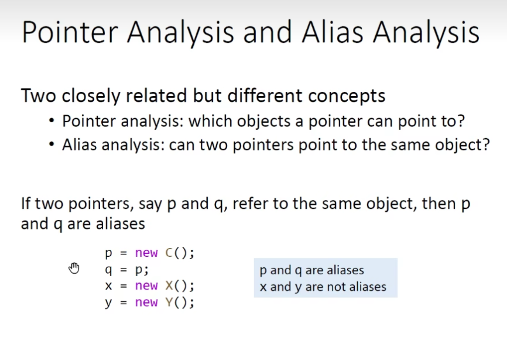  

研究的概念不一样

关键要素

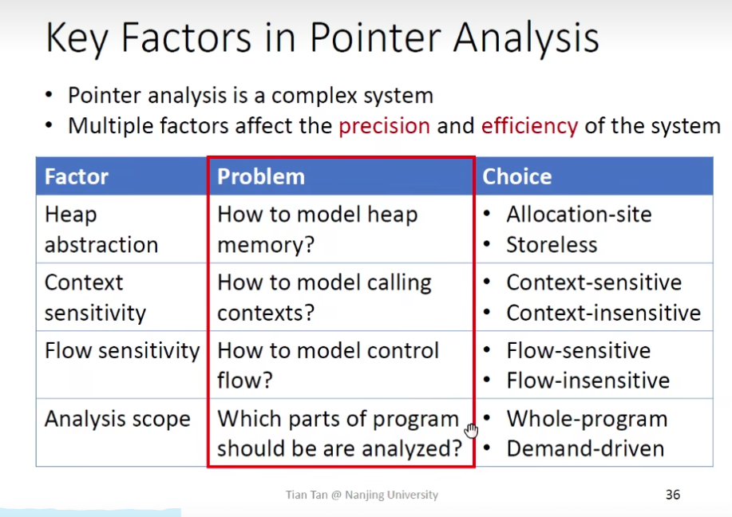  

#### Heap Abstraction

对象不确定地产生，（比如条件、循环）

抽象来确定对象的个数

##### Allocation-Site Abstraction

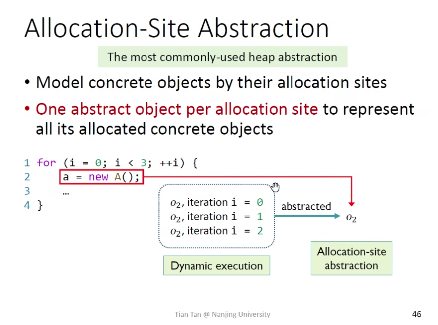  

用一个创建点来归成一个对象，能保证个数有限（程序的new是有限的）

#### Context Sensitivity

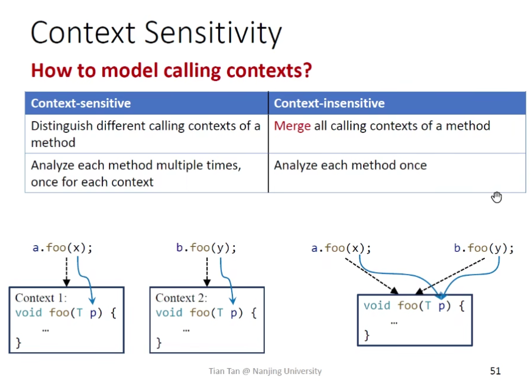  

上下文敏感 && 不敏感，每次调用同一个方法时的上下文并不一样

不敏感：对一个方法只分析一次（不同上下文的当成一个）

#### Flow Sensitivity

如何对 control flow 建模

  

流敏感 && 流非敏感（无序语句的集合）

主要学 flow insensitive，简单、效率高、不准

#### Analysis Scope

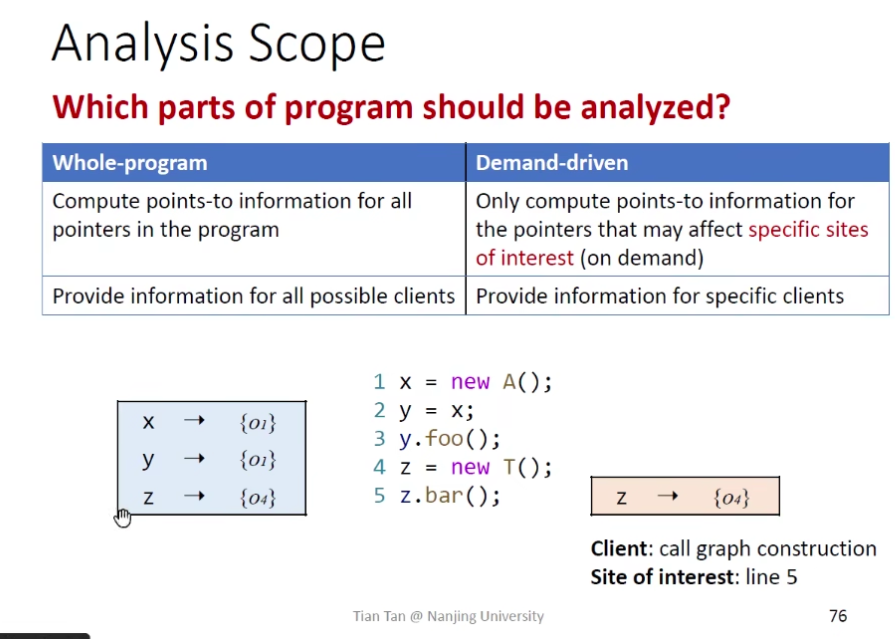  

哪部分程序应当被分析？

只对第五行感兴趣，需要关注的仅仅是 z points to WAHT: z -> {o4}

课程里学 whole program

### Allocation-site

关注的内容

* local var: x
* static field: C.f
* instance field: x.f
  * modeled as an object (pointed by x) with a field f
* array element: arr[i]
  * 忽略 index 建模成一个对象，只有一个 field（因为静态分析无法确定某个 idx 下是哪个元素

  

  

指针分析基本就围绕这五个语句

call 有三种
* static call: C.f()
* special call: super.f()
* virtual call: x.f()

关注的也是 virtual call

## Pointer Analysis Foundation

  

$pt$ 是一个映射，key 为指针，value 为指针指向的对象

$o_i$ 表示某个 site 的对象

Rule for new:

对于 `i: x = new T()`: 有 $o_i ∈ pt(x)$

Rule for assign:

效果就是 alias

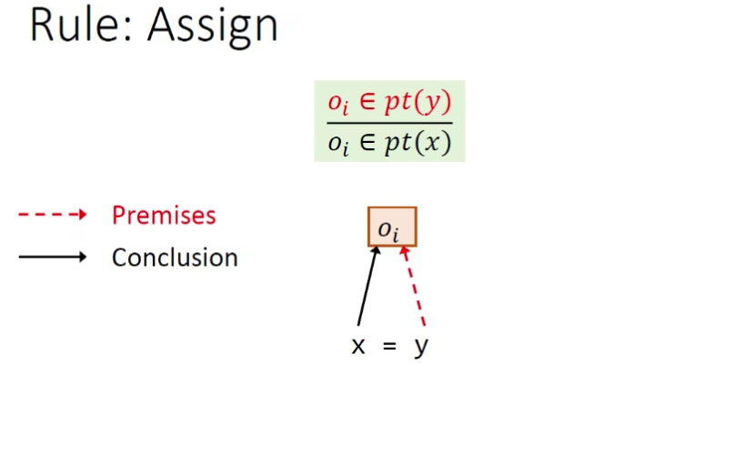

Rule for store:

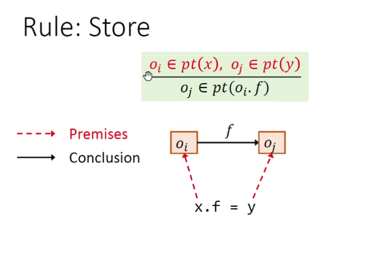  

Rule for load:

  

指针分析：指针指向的传播

最初的指向都来自 new

【包含约束】inclusion constraints

实现关键：当pt(x)变更时，传播该变化到各个x相关的指针

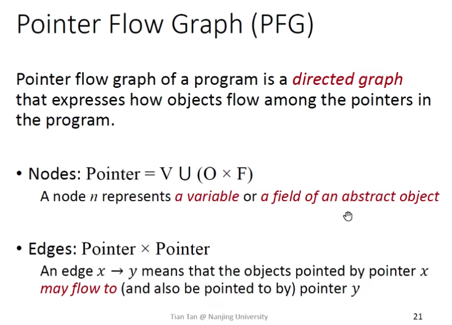  

pfg 的边根据几个规则进行构建

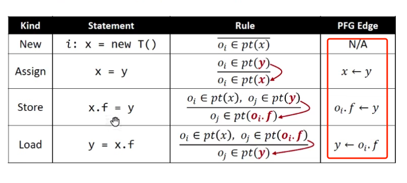  

  

指针分析的实现
1. 建立 pfg
2. 传递 pt

Pointer Analysis Algorithm

work list: kv 集，k 为指针 x，v 为 x 指向集合 pts（可能指向 pts 里的某一个对象）

 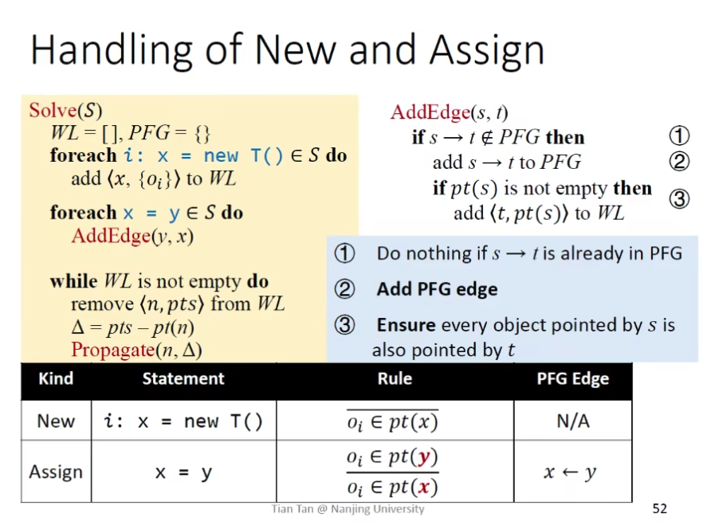  

    

为何要去重？避免冗余的操作（重复传播）

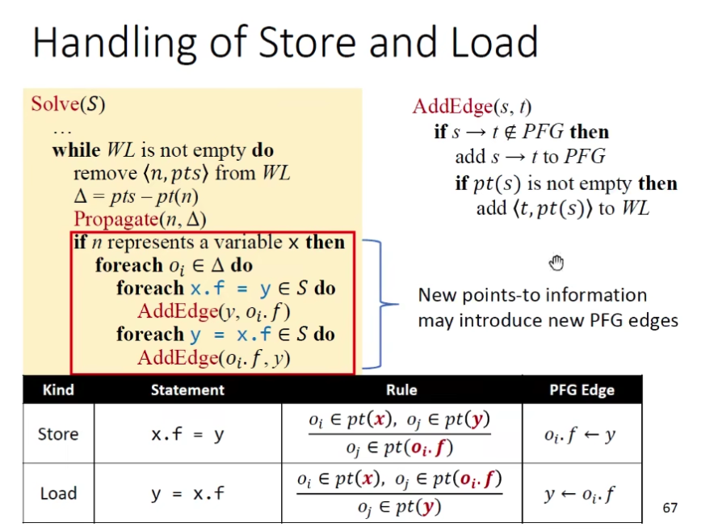  

【可能】引入新的边？可能有 x1.f = y; x2.f = y; 而 x1，x2 可能是同一个 $o_i$ 的对象

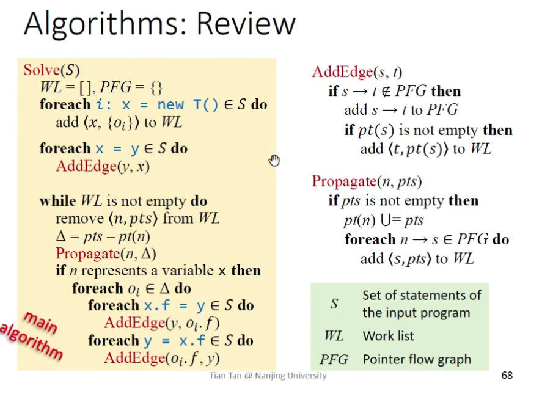  

 
### 指针分析 处理方法调用

CHA 会导致太多假的对象

  

做的事：
1. dispatch 确定实际调用的方法
2. 找接收对象
3. 找实参
4. 传返回值

为何没有 PFG edge $x => m_{this}$

因为只流到自己的对象里，B 类的 this 只会是 B 类对象

  

为什么参数、返回值就能连边

### 过程间指针分析

call graph 组成了一个 reachable world

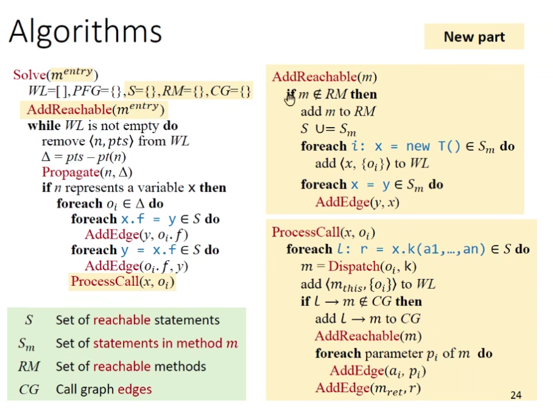  

* AddReachable: 扩展可达的方法
  * 为何漏了 store 和 load 的处理：根据指向的变化（指针集）来处理，但一开始是空的
* 最后多了 ProcessCall

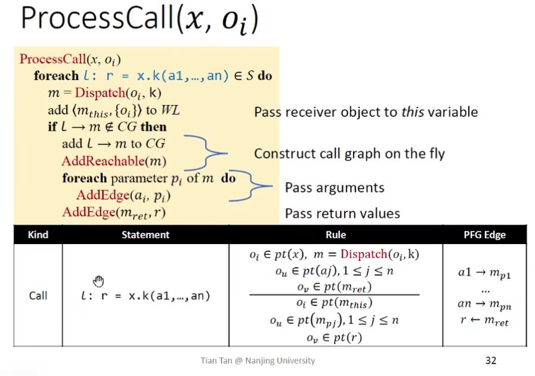  

实参指向形参 a: argument, p: parameter

整个算法的输出：
1. point-to relations (pt)
2. call graph (CG)
