## Iterative Algorithm

  

从更抽象的角度来审视我们的迭代算法，每个块（CFG 里的节点）都会有状态，那么整个程序里所有块能组成一个 k 维向量。

迭代每个节点的时候其实就是对 Block 作函数转换。

我们迭代的停止条件是【一次迭代后 tuple 没变】，其实就到达了不动点

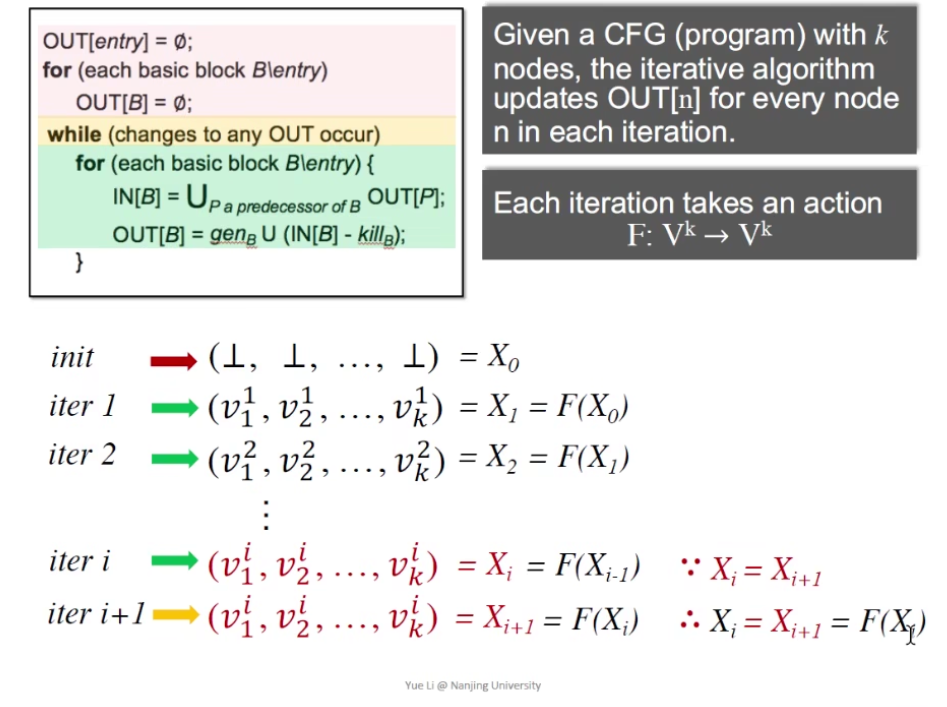  

不动点：

> 数学上不动点的定义：
> $$ X = F(X) $$

为什么标题叫 foundation：domain 并不止之前学的三种，我们可以分析更多的代码性质

三个问题，后面会得到解决：

1. iter algo 一定能找到不动点吗？（算法一定会停下吗？） 
   1. 我们针对前面三种 domain 分析过，会停
   2. 但是这是一个普遍的结论吗？对其他的 domain 呢

2. 如果一定能停，一定有唯一的不动点吗？

3. 什么时候能到达不动点？

## Partial Order (偏序)

poset 偏序集

满足下面三个要求的就是合法的偏序关系

* 自反 reflexivity

* 反对称 antisymmetry

* 传递 transitivity

  

例子1：

**( integer, <= )** 是不是偏序集？

* 性质都满足，是

例子2：

**( integer, < )** 是不是偏序集？

* 不满足自反，不是

为什么叫偏序？不是全部元素都能比较

  

（需要记住这个图，<abc, 包含关系> 组成的全格）

## Upper & Lower Bounds （上下界）

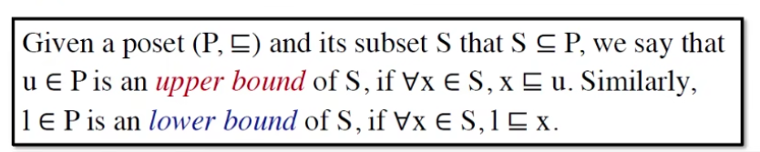  

* x 不一定在 S 里

  

* 最小上界 lub => join
* 最大下界 glb => meet

  

* 不是所有偏序集都有 lub 或者 glb
* 如果 poset 有 lub 或者 glb，那么 lub 和 glb 一定是唯一的（用反对称性很容易证明：互相对同一个关系成立就一定是同一个）

## Lattice（格）

  

poset 中每一对元素都存在最大下界和最小上界（大白话：两个元素都会 meet (∩) 和 join (∪) ）

* (integer, <=) 是不是 lattice？
  * 是，任意两个数可以 meet 和 join

### Semilattice（半格）

  

* P 里任意两个元素都有 lub 和 glb，就是半格

### Complete Lattice（全格）
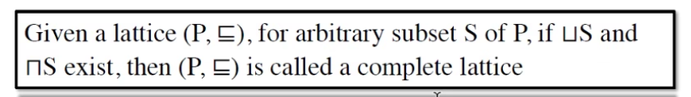  

* 任意 P 的子集都会有 lub 和 glb 就是全格
* (integer, <=) 是不是 compete lattice？
  * 否，整数集不符合（找不到最小的上界/最大的下界）

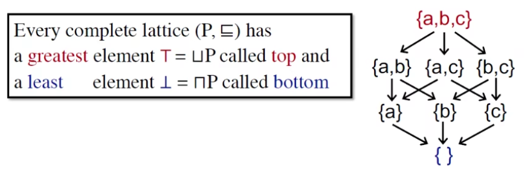  

* 每个有穷的格一定是完全格
* 反命题为伪：{ [0,1]小数集, < } 完全且无穷：任意子集都能找到一个上下限

### Product Lattice

  

* 每个 L 都是 complete，那么组成的 product lattice $L^n$ 也是 complete 的

## Data Flow Analysis Framework via Lattice

其实是 semi，但是用 lattice 来表示更加方便

定义一个 Data flow analysis 的框架：由 <方向、格、转换函数> 组成

 

例子：

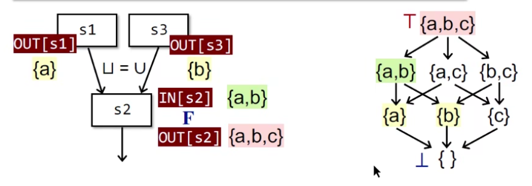  

* 顺序是反过来的（ Block 的执行流跟格的方向）
* {a, b, c} 用 bit vector 表示就是 111, {} 就是 000

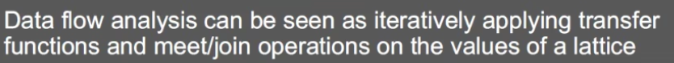  

Data flow analysis 的本质：在一个格上迭代一个 transfer、并不断 meet 和 join

回答前面的问题：
1. 迭代算法一定能达到不动点吗
   1. OUT never shrinks (monotonicity)
2. 如果能，可能有多个不动点吗
   1. 可以
3. 如果有多个不动点，能不能找到最好的（迭代次数最少）
   1. 可以

### Monotonicity

不动点定理

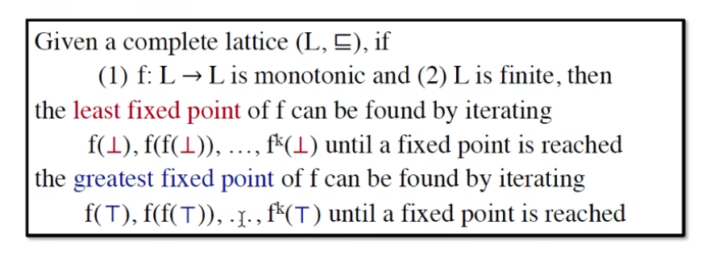  

* 全格、单调、有限 => 就能迭代出最优的不动点
* complete 不一定 finite

求证:
1. 存在不动点
2. 迭代得到的不动点最小

证明：
1. fixed point exists

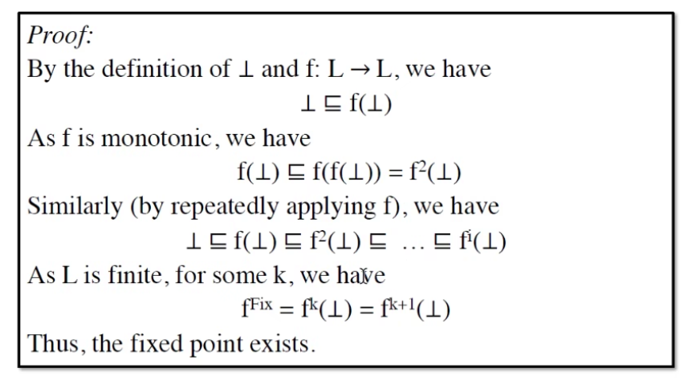  

2. least fixed point

数学归纳法: 假设 k 成立 + 证明初始成立 => 证明 k + 1 成立 => 定理成立

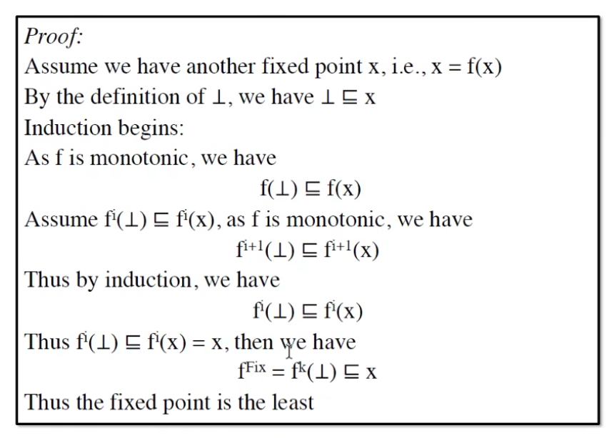  

证出来是 unique fixed point

## Relative between Iter Algo & Fixed Point Theorem

迭代算法能不能关联上不动点定理？能关联上才能说这个迭代算法能找到最优的不动点。

直觉上的证明：

  

1. 单调：OUT 不会 shrink (gen - kill 单调)
2. 有限：很显然，集合是有限的，集合的有限次幂也是

多少次迭代能到达不动点？

  

* 最坏情况 k 个块 (nodes in CFG，在 example 的视角就是一个比特)、高度 h，最坏情况是 i = h * k 次迭代

## May and Must Analysis, a Lattice View

### May

  

在 Reaching Definition Analysis 里，1 是能 reach，0 是不能 reach，即在程序终点这个地方，有哪些定义是可能被用到的。

我们从空集去找，就是我们从**敢**说程序里所有的定义都不会被消费到，显然是不对的，我们从不安全的一个状态去找到安全的一个点。

注意 bottom 是 Basic Blocks 的顶点，也就是程序的开始

一定会找到最小不动点，前面证明过了

  

top 是最没用的（相当于整个程序里的定义全部都**可能**到达末尾，能到结束的定义都在里面，但是有部分并不会到，所以是安全的，做了一些多余的防范）

### Must

May Analysis 是从错里面去改正，Must 是从对的里去找错，前者是 sound 的，后者是 complete 的。

  

## How Precise is Our Solution

有些分支永远不会执行如 `if (false) `，我们依然认为这条分支里的数据是有用的，这样就造成了失真

### Meet-Over-All-Paths Solution (MOP)

假设有个程序 P = Entry -> S1 -> S2 -> ... -> Si

$$ MOP[S_i] = ∪/∩ F_p(OUT[Entry]) $$

MOP 会计算 data-flow 的值，然后把他们 meet / join

  

* 之前的迭代算法是 bfs，一边 meet/join 一边走，MOP 是 dfs，把 path 走完再 meet/join

### Iter Algo VS MOP

  

* 谁更准：MOP

什么时候等于？

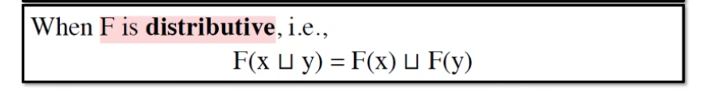  

* F 有可分配性
* 之前的三个分析都是可分配的

### Constant Propagation

作业：

   

  

V 集合有三种类型的值：
* 未定义（Undefined）
* 某个具体值
* 非常量（Not A Constant）

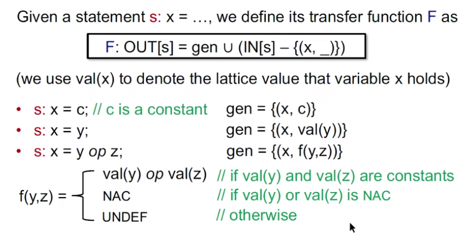  

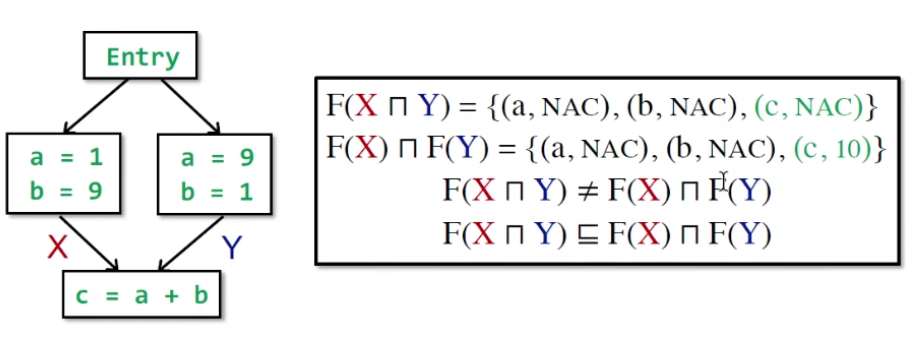  

在上面的例子里，显然 MOP 更准。肉眼可见 c 是个常量，只看结果

## Worklist Algorithm

是对 Iterative Algorithm 的优化

Iter Algo 的缺点：只要有一个 Block 发生变化，就要把全部都重新算一遍

  

* 把发生变化的丢队列里，然后只计算需要更新的