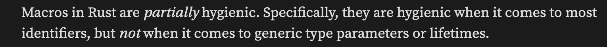

https://dtolnay.github.io/rust-quiz

因为 Quiz 是乱序的，所以完成进度也是乱序的

## Quiz 24：关于宏的 'hygiene'

https://dtolnay.github.io/rust-quiz/24

What is the output of this Rust program?
```rust
fn main() {
    let x: u8 = 1;
    const K: u8 = 2;

    macro_rules! m {
        () => {
            print!("{}{}", x, K);
        };
    }

    {
        let x: u8 = 3;
        const K: u8 = 4;

        m!();
    }
}
```

### 解答

输出 `14`

对于宏而言有一个概念叫 hygiene，中文是【卫生】的意思，由【宏如何处理外部变量】来区分是否 hygiene

[有一个 reddit 上对此的讨论](https://www.reddit.com/r/rust/comments/5v8r8f/so_what_are_hygienic_macros_anyway/)，摘抄一个回答：

> For example, if you declare a variable named x inside a macro and you happen to call that macro on an x from somewhere else, it won't suddenly and magically cause things to break because the compiler will know that they're two different things.
> 
> (The gist is that macros in languages like C have some very surprising misbehaviours and "hygienic" macros will behave more like functions when it comes to things like variable scopes and order of operations.)

如果编译器不处理出现在宏里的变量名，而是等着直接展开（如 C 语言），那么这个应该算作不卫生，因为可能会出现外部变量命名为 a，而宏内使用了 a 变量，使用结果会因为外部变量命名不同而有变化。

Rust 是门“部分卫生”的语言，会对一部分的外部变量进行处理。但是仅限本地变量，对 const 不会做处理（const 变量会被认为是个普通的单词而不是变量）。因此在这题里，Rust 会先把外边的 x 编进宏内，之后再进行展开，最终打印 `14`。

[hygiene 相关的笔记](https://danielkeep.github.io/tlborm/book/mbe-min-hygiene.html)

  