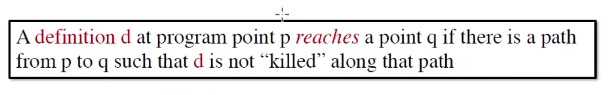
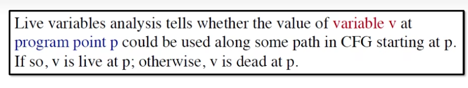
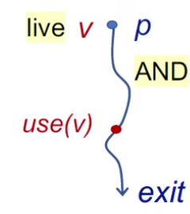

## Preliminary

### 什么是 Input 和 Output States

程序是个状态机，在一个语句执行前后都应当有一个状态，保存着比如变量信息、上下文等等的内容，然后语句的执行其实就是状态机的一条边，改变了程序的状态

对于一个 Basic Block 而言，执行流不过以下三种：1 to 1, 1 to n, n to 1

 

## Reaching Definition Analysis

  

rda 能确定一个在 program point p 时的定义 D 在 program point q 是否有效的，即这个 D 里定义的变量 v 能不能在 q 时被安全地使用。如果有一条 path 能让 D 能够 reach 到 q，那么在 q 点使用 v 是安全的（即能够用到在 p 点定义的 v）

  

上图里，v 在 p -> q 的路径上被重新定义了，说明我们无法在 q 点之后消费到 p 点定义的 v，我们说 definition d 在 q 点是无效的

* 应用：可以判断用于变量是否被初始化

### Algorithm

使用 forward analysis，从头开始分析

公式：

$$ OUT[B] = gen[B] ∪ (IN[B] - kill[B])$$
$$ IN[B] = ∪ OUT[P] $$

其中 P 是 B 的所有前驱块

gen[B] 是在 B 中的定义，比如:
* B: `D1: m = a; D2: n = b;` 则 gen[B] == {D1, D2}

kill[B] 是在其他块中会被 B 里定义所覆盖的定义，比如：
* B1: `D1: m = a`
* B2: `D2: m = b`
* 那么 kill[B1] == {D2}

算法伪代码如下：

  

算法脑跑，要点：

* 结束条件是所有 OUT 在上次迭代里不变
* May Analysis，即 sound 的，可能误报但不会漏报，有可能被覆盖，但可能在某些 path 里并不会被覆盖
* 算法一定会停下：因为 OUT 的大小非减，而有明确的上界（即定义的全集，在 bit vector 里就是全 1），因此一定会收敛，停下的点叫不动点 (fixed point)

  

## Live Variables Analysis

LVA 能判断 **变量 v** 能不能从程序点 p 开始沿着 CFG 路径被使用，如果能，说明 v 在 p 点是活着的，否则是死的。

对于一个死变量，说明以后不会被 use 到，用于资源分配的优化：寄存器分配策略 => 优先干死 dead value

* 分析的是变量
* 要求 v 在被使用前不能被再次定义

### Algorithm
使用 backward analysis 更方便，我们从程序结束的地方开始往前分析，得到变量在各个 program point 时的存活状态（即是否在 p 点后面会被使用）

如上图，S 是 B 的后继块，即有 B -> S1, B -> S2 等等

IN[B], OUT[B] 表示**存活变量的集合**，则有以下公式

$$ OUT[B] = ∪ IN[S] $$
$$ IN[B] = use[B] ∪ (OUT[B] - def[B]) $$

其中 use[B] 的元素是在 B 中（在定义前）被使用的变量，比如:
*  B:  `m = k; n = j` ，use[B] == {k, j}
*  B: `m = k; n = m - 1` ，use[B] == {k}，m 不算在里面，因为其是在 B 里定义后被使用的

def[B] 的元素是在 B 中被定义的变量，比如：
* B: `m = k; n = j`，def[B] == {m, n}

公式里的 OUT[B] 很好理解，在即将进入 S 块时还活着的，一定在离开 B 时也活着，所以取并。

而 IN[B] 首先考虑的是在 B 里被使用的变量（不能是 B 里定义并使用）在进入 B 时一定活着；然后如果有一个变量在离开 B 时还活着，但是这个变量又不是在 B 里被定义的，那么一定是从上一个块传进来的，所以我们还要加上 OUT[B] - def[B]。

算法自己脑跑一遍，一些要点：

* 集合的表示方式使用 bit vector 的方式，给每个变量赋予一位的大小，1 表示存活，0 表示死亡。
* LVA 是 May Analysis，即 sound 的，可能误报但不会漏报（对某条 path A，可能某个变量 a 一直不会用到，但是在 path B 里 a 被用到了，那么我们认为分叉到 A 和 B 前的交点 a 应该是活着的，尽管代码可能不跑 B）
* 结束条件是在上一次迭代里对所有 Basic Block B，IN[B] 都没变

## Available Expression Analysis

AEA 能判断一个表达式在 program point p 是不是有效的

`x op y` 在 p 点有效的成立条件：
1. 从起点开始所有到 p 的 path 都要经过 `x op y` 的值
2. 没有重新定义 `x op y` 里的变量（x 或者 y）

**AEA 关注的是 expression**，可以用于优化：对所有 path，如果某个表达式一直出现而且没变，就可以直接复用之前的结果，节省计算

AEA 使用的是 forward analysis，公式：

$$ OUT[B] = gen[B] ∪ (IN[B] - kill[B]) $$
$$ IN[B] = ∩ OUT[P] $$

P 是 B 的前驱，其中对 gen[B] 与 kill[B] 的计算方法如下：
  

* gen[B] 就是 B 里出现的 `x op y` 表达式的集合
* kill[B] 是对 IN[B] 里表达式变量成员有做重定义的表达式的集合
* 注意 IN[B] 是对前驱块 OUT 的交集，因为要求所有 path 都经过（这样才能达到 safe 的要求）

再比如下图：

  

a 被重定义了，因此 kill[B] 就是 IN 中有变量被重定义的表达式，即 kill[B] == {a+b}，而 IN[B] - kill[B] == {}

### Algorithm

 

下面的例子脑跑，要点：

* must: 需要 safety，所以必须 under-approximation，不能误报
* 结束条件是 OUT 不变
* entry 初始化为空，而其余的都初始化 All，因为要取交集，如果以空开局就全0了

  

## Comparison

  

* 三种分析针对三种不同的集合（定义集合、变量集合、表达式集合）
* Transfer 核心其实都是一样的，只是 LVA 是 backward analysis，所以把 IN 反过来计算